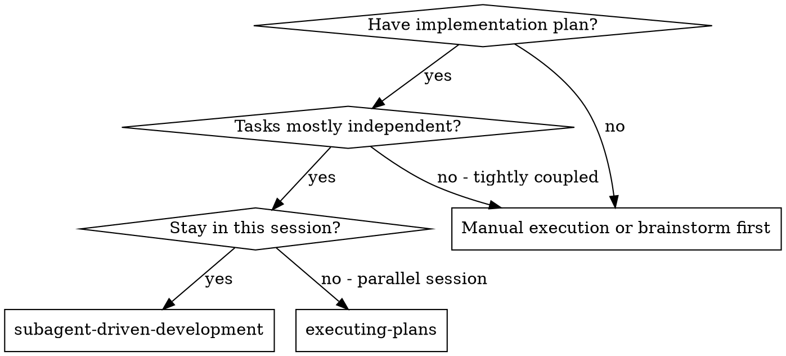
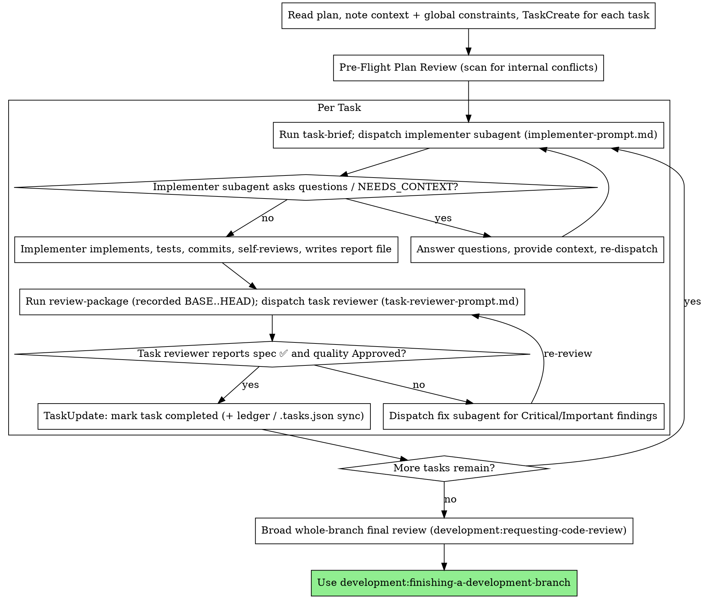

# Subagent-Driven Development

Execute plan by dispatching a fresh implementer subagent per task, a single task review (spec compliance + code quality) after each, and a broad whole-branch review at the end.

**Why subagents:** You delegate tasks to specialized agents with isolated context. By precisely crafting their instructions and context, you ensure they stay focused and succeed at their task. They should never inherit your session's context or history — you construct exactly what they need. This also preserves your own context for coordination work.

**Core principle:** Fresh subagent per task + one task review (spec + quality) + broad final review = high quality, fast iteration

**File handoffs:** Keep bulk text out of your context. Task briefs, implementer reports, and review diffs move as files under the scratch dir (`scripts/sdd-workspace`, next to this skill, prints it: `<repo-root>/.development/sdd`), not as pasted prose. You curate the pointers; the subagents read the files.

**Continuous execution:** Do not pause to check in with your human partner between tasks. Execute all tasks from the plan without stopping. The only reasons to stop are: BLOCKED status you cannot resolve, ambiguity that genuinely prevents progress, a Pre-Flight conflict to adjudicate, or all tasks complete. "Should I continue?" prompts and progress summaries waste their time — they asked you to execute the plan, so execute it.

## When to Use



**vs. Executing Plans (parallel session):**
- Same session (no context switch)
- Fresh subagent per task (no context pollution)
- One review after each task (spec compliance + code quality), broad review at the end
- Faster iteration (no human-in-loop between tasks)

## The Process



## Pre-Flight Plan Review

Before dispatching Task 1, scan the plan once for conflicts:

- tasks that contradict each other or the plan's Global Constraints
- anything the plan explicitly mandates that the review rubric treats as a
  defect (a test that asserts nothing, verbatim duplication of a logic block)

Present everything you find to your human partner as one batched question —
each finding beside the plan text that mandates it, asking which governs —
before execution begins, not one interrupt per discovery mid-plan. If the
scan is clean, proceed without comment. The per-task review loop and the
broad final review remain the net for conflicts that only emerge from
implementation.

## Dispatching with Metadata

When dispatching an implementer subagent:
1. Read the task's description via TaskGet — metadata is embedded as a `json:metadata` code fence at the end
2. Parse the metadata JSON and map fields (files, acceptanceCriteria, verifyCommand, modelTier) to the implementer prompt sections
3. The implementer should receive ALL structured data — don't make them parse it from prose
4. Hand over bulk task text as a FILE: run `"${CLAUDE_PLUGIN_ROOT}/scripts/task-brief" PLAN_FILE N "$(scripts/sdd-workspace)"` (it writes the task's full text into that directory and prints the path), and point the implementer at that brief file rather than pasting the task text into the dispatch (see File Handoffs)

## Model Selection

Use the least powerful model that can handle each role to conserve cost and increase speed. You do NOT hard-code a literal `model:` — signal the intended tier in the task's metadata (`"modelTier"`). Your job here is judgment: which tier fits which role.

**Mechanical implementation tasks** (isolated functions, clear specs, 1-2 files): `mechanical` tier. Most implementation tasks are mechanical when the plan is well-specified.

**Integration and judgment tasks** (multi-file coordination, pattern matching, debugging): `standard` tier.

**Architecture, design, and review tasks**: `frontier` tier. The broad whole-branch final review is one of these — give it the most capable tier, not the session default.

**Review tasks**: choose the tier with the same judgment, scaled to the diff's size, complexity, and risk. A small mechanical diff does not need the most capable tier; a subtle concurrency change does.

**Turn count beats token price.** Wall-clock and context cost scale with how many turns a subagent takes, and the cheapest models routinely take 2-3× the turns on multi-step work — costing more overall. Use the `standard` tier as the floor for reviewers and for implementers working from prose descriptions. When the task's brief contains the complete code to write, the implementation is transcription plus testing: the `mechanical` tier fits. Single-file mechanical fixes also take the `mechanical` tier.

**Task complexity signals (implementation tasks):**
- Touches 1-2 files with a complete spec → `mechanical` tier
- Touches multiple files with integration concerns → `standard` tier
- Requires design judgment or broad codebase understanding → `frontier` tier

## Handling Implementer Status

Implementer subagents report one of four statuses (the short summary; the full detail is in the report file). Handle each appropriately:

**DONE:** Generate the review package — `"${CLAUDE_PLUGIN_ROOT}/scripts/review-package" --workdir "$(scripts/sdd-workspace)" --task N --round I --range BASE HEAD` (round I starts at 1, +1 per re-review; it prints the file path it wrote). BASE is the commit you recorded before dispatching the implementer — never `HEAD~1`, which silently drops all but the last commit of a multi-commit task. Then dispatch the task reviewer with the printed `[DIFF_FILE]` path.

**DONE_WITH_CONCERNS:** The implementer completed the work but flagged doubts. Read the concerns before proceeding. If the concerns are about correctness or scope, address them before review. If they're observations (e.g., "this file is getting large"), note them and proceed to review.

**NEEDS_CONTEXT:** The implementer needs information that wasn't provided. Provide the missing context and re-dispatch.

**BLOCKED:** The implementer cannot complete the task. Assess the blocker:
1. If it's a context problem, provide more context and re-dispatch with the same tier
2. If the task requires more reasoning, re-dispatch with a more capable tier
3. If the task is too large, break it into smaller pieces
4. If the plan itself is wrong, stop and report the problem — do not invent a fix

**Never** ignore an escalation or force the same tier to retry without changes. If the implementer said it's stuck, something needs to change.

## Handling Reviewer ⚠️ Items

The task reviewer may report "⚠️ Cannot verify from diff" items — requirements
that live in unchanged code or span tasks. These do not block the rest of the
review, but you must resolve each one yourself before marking the task
complete: you hold the plan and cross-task context the reviewer lacks. If you
confirm an item is a real gap, treat it as a failed spec review — send it back
to the implementer (fix subagent) and re-review.

## Constructing Reviewer Prompts

Per-task reviews are task-scoped gates. The broad review happens once, at the
final whole-branch review. When you fill the task reviewer template:

- Do not add open-ended directives like "check all uses" or "run race tests
  if useful" without a concrete, task-specific reason
- Do not ask a reviewer to re-run tests the implementer already ran on the
  same code — the implementer's report file carries the test evidence
- Do not pre-judge findings for the reviewer — never instruct a reviewer to
  ignore or not flag a specific issue, and never pre-rate a finding's
  severity ("at most Minor," "the plan chose it"). If you believe a finding
  would be a false positive, let the reviewer raise it and adjudicate it in
  the review loop.
- The global-constraints block you hand the reviewer is its attention lens.
  Copy the binding requirements verbatim from the plan's Global Constraints
  section or the spec: exact values, exact formats, and stated relationships
  between components ("same layout as X", "matches Y"). The reviewer's
  template already carries the process rules (YAGNI, test hygiene, review
  method) — the constraints block is for what THIS project's spec demands.
- Hand the reviewer its diff as a file: run `"${CLAUDE_PLUGIN_ROOT}/scripts/review-package" --workdir "$(scripts/sdd-workspace)" --task N --round I --range BASE HEAD`
  and pass the printed `[DIFF_FILE]` path. The output never enters your own
  context, and the reviewer sees the commit list, stat summary, and full diff
  with context in one Read call. Use the BASE you recorded before dispatching
  the implementer — never `HEAD~1`, which silently truncates multi-commit
  tasks.
- A dispatch prompt describes one task, not the session's history. Do not
  paste accumulated prior-task summaries into later dispatches. A fresh
  subagent needs its brief, the interfaces it touches, and the global
  constraints. Nothing else.
- Dispatch fix subagents for Critical and Important findings. Record Minor
  findings in the progress ledger as you go, and point the broad final
  review at that list so it can triage which must be fixed before merge.
- A finding labeled plan-mandated — or any finding that conflicts with what
  the plan's text requires — is the human's decision, like any plan
  contradiction: present the finding and the plan text, ask which governs.
  Do not dismiss the finding because the plan mandates it, and do not
  dispatch a fix that contradicts the plan without asking.
- Every fix dispatch carries the implementer contract: the fix subagent
  re-runs the tests covering its change and appends the results to the
  report file. Name the covering test files in the dispatch — a one-line fix
  does not need the whole suite. Before re-dispatching the reviewer, confirm
  the fix report contains the covering tests, the command run, and the
  output.

## File Handoffs

Everything you paste into a dispatch prompt — and everything a subagent
prints back — stays resident in your context for the rest of the session and
is re-read on every later turn. Hand artifacts over as files. Resolve the
scratch dir once with `scripts/sdd-workspace` (it prints
`<repo-root>/.development/sdd` and ensures it self-ignores):

- **Task brief:** before dispatching an implementer, run `"${CLAUDE_PLUGIN_ROOT}/scripts/task-brief" PLAN_FILE N "$(scripts/sdd-workspace)"` — it extracts the task's full text to a uniquely named file
  (`…/task-N-brief.md`) and prints the path. Compose the dispatch so the
  brief stays the single source of requirements. Your dispatch should
  contain: (1) one line on where this task fits in the project; (2) the
  brief path (the `[BRIEF_FILE]` input), introduced as "read this first — it
  is your requirements, with the exact values to use verbatim"; (3)
  interfaces and decisions from earlier tasks that the brief cannot know;
  (4) your resolution of any ambiguity you noticed in the brief; (5) the
  `[REPORT_FILE]` path and report contract. Exact values (numbers, magic
  strings, signatures, test cases) appear only in the brief.
- **Report file:** name the implementer's `[REPORT_FILE]` after the brief
  (brief `…/task-N-brief.md` → report `…/task-N-report.md`) and put it in
  the dispatch prompt. The implementer writes the full report there and
  returns only status, commits, a one-line test summary, and concerns
  (see implementer-prompt.md).
- **Reviewer inputs:** the task reviewer gets three paths — the same
  `[BRIEF_FILE]`, the `[REPORT_FILE]`, and the review package
  (`[DIFF_FILE]`) — plus the `[GLOBAL_CONSTRAINTS]` that bind the task.
- Fix dispatches append their fix report (with test results) to the same
  report file and return a short summary; re-reviews read the updated file.

## Durable Progress

Conversation memory does not survive compaction. Controllers that lose their
place have re-dispatched entire completed task sequences — an expensive
failure. Track progress in a ledger file, not only in native tasks.

- At skill start, check for a ledger:
  `cat "$(git rev-parse --show-toplevel)/.development/sdd/progress.md"`. Tasks
  listed there as complete are DONE — do not re-dispatch them; resume at the
  first task not marked complete.
- When a task's review comes back clean, append one line to the ledger in the
  same message as your other bookkeeping (TaskUpdate + Task Persistence Sync):
  `Task N: complete (commits <base7>..<head7>, review clean)`.
- The ledger is your recovery map: the commits it names exist in git even when
  your context no longer remembers creating them. After compaction, trust the
  ledger and `git log` over your own recollection.
- `git clean -fdx` will destroy the ledger (it's git-ignored scratch); if that
  happens, recover from `git log`.

## Prompt Templates

- [implementer-prompt.md](implementer-prompt.md) - Dispatch implementer subagent (writes its report to `[REPORT_FILE]`)
- [task-reviewer-prompt.md](task-reviewer-prompt.md) - Dispatch task reviewer subagent — one pass, returns spec compliance + code quality (+ ⚠️ can't-verify) verdicts; reads the diff from `[DIFF_FILE]`
- Broad whole-branch final review: use **development:requesting-code-review**'s [code-reviewer.md](../requesting-code-review/code-reviewer.md)

## Example Workflow

```
You: I'm using Subagent-Driven Development to execute this plan.

[Read plan file once: docs/development/plans/feature-plan.md]
[TaskCreate for each task with full description + metadata]
[Pre-Flight Plan Review: scan plan for internal conflicts — clean, proceed]

Task 1: Hook installation script

[Run task-brief plan.md 1 "$(sdd-workspace)" → .development/sdd/task-1-brief.md]
[Dispatch implementer: brief path + report path + scene-setting context]

Implementer: "Before I begin - should the hook be installed at user or system level?"

You: "User level (~/.config/development/hooks/)"

[Re-dispatch implementer with the answer]
[Later] Implementer (short summary):
  - Status: DONE
  - Commits: abc1234 install-hook command
  - 5/5 passing, output pristine
  - Report: .development/sdd/task-1-report.md

[Run review-package --workdir … --task 1 --round 1 --range BASE HEAD → .development/sdd/review-task-1-r1.diff]
[Dispatch task reviewer: brief + report + diff file + global constraints]
Task reviewer:
  Spec Compliance: ✅ Spec compliant
  Strengths: Good test coverage, clean
  Issues: None
  Task quality: Approved

[Mark Task 1 complete: TaskUpdate + ledger line + .tasks.json sync]

Task 2: Recovery modes

[Run task-brief; dispatch implementer with brief + report paths + context]

Implementer: [No questions, proceeds]
Implementer (short summary): Status DONE, 8/8 passing, report written

[Run review-package; dispatch task reviewer with the printed diff path]
Task reviewer:
  Spec Compliance: ❌ Issues found:
    - Missing: Progress reporting (spec says "report every 100 items") (recovery.sh:42)
    - Extra: Added --json flag (not requested) (cli.sh:18)
  Issues (Important): Magic number 100 (recovery.sh:55)
  Task quality: Needs fixes

[Dispatch ONE fix subagent with all findings]
Fixer: Removed --json flag, added progress reporting, extracted PROGRESS_INTERVAL

[Re-run review-package; re-dispatch task reviewer]
Task reviewer: Spec ✅. Task quality: Approved.

[Mark Task 2 complete]

...

[After all tasks]
[Broad whole-branch final review via development:requesting-code-review]
Final reviewer: All requirements met, ready to merge

Done!
```

## Advantages

**vs. Manual execution:**
- Subagents follow TDD naturally
- Fresh context per task (no confusion)
- Parallel-safe (subagents don't interfere)
- Subagent can ask questions (before AND during work)

**vs. Executing Plans:**
- Same session (no handoff)
- Continuous progress (no waiting)
- Review checkpoints automatic

**Efficiency gains:**
- Controller curates exactly what context is needed; bulk artifacts (briefs,
  reports, diffs) move as files, not pasted text
- Subagent gets complete information upfront
- Missing context surfaced upfront as NEEDS_CONTEXT (not discovered mid-work)

**Quality gates:**
- Self-review catches issues before handoff
- One task review carries two verdicts: spec compliance and code quality
- Review loops ensure fixes actually work
- Spec compliance prevents over/under-building
- Code quality ensures implementation is well-built
- One broad whole-branch review at the end catches cross-task issues

**Cost:**
- More subagent invocations (implementer + one reviewer per task + broad final review)
- Controller does more prep work (extracting all tasks upfront)
- Review loops add iterations
- But catches issues early (cheaper than debugging later)

## Red Flags

**Never:**
- Start implementation on main/master branch without explicit user consent
- Skip the task review, or accept a report missing either verdict (spec compliance AND code quality are both required in the one review)
- Skip the broad whole-branch final review at the end
- Proceed with unfixed Critical/Important issues
- Dispatch parallel implementers whose tasks' `files` overlap or that appear in each other's `blockedBy` chain (write conflicts — disjoint tasks and read-only agents MAY run in parallel; see Bounded Parallel Dispatch)
- Make a subagent read the whole plan file (hand it its task brief — `${CLAUDE_PLUGIN_ROOT}/scripts/task-brief` — instead)
- Skip scene-setting context (subagent needs to understand where task fits)
- Ignore subagent questions (answer before letting them proceed)
- Accept "close enough" on spec compliance (reviewer found spec issues = not done)
- Skip review loops (reviewer found issues = fix = review again)
- Let implementer self-review replace actual review (both are needed)
- Dispatch a task reviewer without a diff file — generate it first (`${CLAUDE_PLUGIN_ROOT}/scripts/review-package` with the task's `--range BASE HEAD`) and name the printed `[DIFF_FILE]` path in the prompt
- Move to next task while the review has open Critical/Important issues
- Re-dispatch a task the progress ledger already marks complete — check the ledger (and `git log`) after any compaction or resume

**Anti-suppression (you do not get to silence the review):**
- Never tell a reviewer what to ignore, or pre-rate a finding's severity in the dispatch prompt — the plan's example code is a starting point, not evidence its weaknesses were chosen.
- A plan-mandated defect is REPORTED, not waved through: surface the finding beside the plan text and let the human decide which governs. You do not get to overrule a reviewer because "the plan said so."
- Reviewers are read-only and skeptical of the implementer's rationales: a stated rationale ("kept it simple per YAGNI") never downgrades a finding.
- Every finding carries a file + line. A finding without evidence is not actionable — send it back for evidence rather than acting on a bare claim.

**If subagent asks questions:**
- Answer clearly and completely
- Provide additional context if needed
- Don't rush them into implementation

**If reviewer finds issues:**
- Dispatch a fix subagent (carries the implementer contract — re-runs covering tests, appends to the report file)
- Re-run review-package and re-review
- Repeat until approved
- Don't skip the re-review

**If subagent fails task:**
- Dispatch fix subagent with specific instructions
- Don't try to fix manually (context pollution)

## Bounded Parallel Dispatch

The Red Flag above forbids overlapping writers, not parallelism. Dispatch concurrently when every running agent passes the disjointness test:

- **Read-only agents are always parallel-safe**: audits, log analysis, verification gates, long-running test suites (these are also ideal for free local agent types while implementation continues).
- **Implementers may run concurrently ONLY when** their tasks' `files` lists share no path AND neither task appears in the other's `blockedBy` chain. The `files` metadata IS the test — no overlap means no conflict.
- **Never** two writers on one file, and never use parallelism to skip reviews: each task still gets its own task review (spec + quality) as it completes, and the one broad whole-branch review still runs once at the end.
- Mark every parallel task `in_progress` BEFORE dispatching its agent.
- When overlap is uncertain, serialize. The sequential per-task loop above remains the default; parallelism is the optimization, not the baseline.

## Task Persistence Sync

After marking each task completed via `TaskUpdate`, update the `.tasks.json` file to stay in sync:

1. Read `<plan-path>.tasks.json`
2. Set the task's `"status"` to `"completed"`
3. Set `"lastUpdated"` to current ISO timestamp
4. Write the file back

This ensures cross-session resume works correctly. Without this, a new session loading `.tasks.json` would see completed tasks as `"pending"`. (The progress ledger in Durable Progress is the in-flight recovery map; `.tasks.json` is the persisted task state.)

## Integration

**Required workflow skills:**
- **development:using-git-worktrees** - REQUIRED: Set up isolated workspace before starting
- **development:writing-plans** - Creates the plan this skill executes
- **development:requesting-code-review** - Code review template for the broad whole-branch final review
- **development:finishing-a-development-branch** - Complete development after all tasks

**Subagents should use:**
- **development:test-driven-development** - Subagents follow TDD for each task

**Alternative workflow:**
- **development:executing-plans** - Use for parallel session instead of same-session execution
